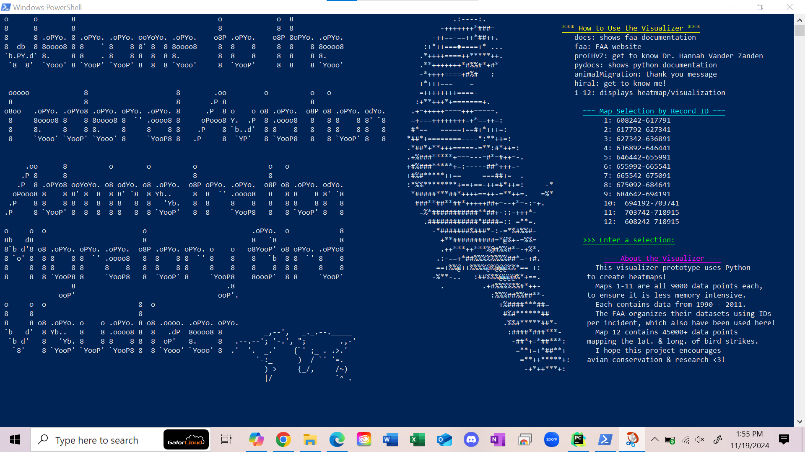
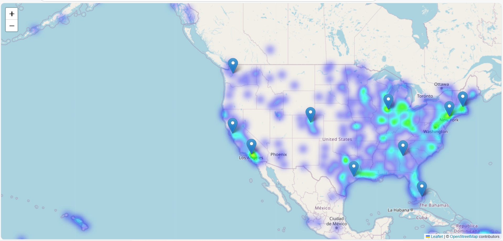

# Federal Aviation Association Migratory Bird Visualizer

# Table of Contents
- [What is the Migratory Bird Visualizer?](#what-is-the-migratory-bird-visualizer)
- [Installation](#installation)
- [Instructions](#instructions)
- [Commands](#commands)
- [How HeatMaps are Made](#how-heatmaps-are-made)
- [Initial Commit Info](#initial-commit-info)
- [Contributing](#contributing)

# What is the Migratory Bird Visualizer?
This visualizer prototype uses Python to create heatmaps!
Maps 1-11 are all 9000 data points each, to ensure it is less memory intensive.
Each contains data from 1990 - 2011.
The FAA organizes their datasets using IDs per incident, which also have been used here!
Map 12 contains 45000+ data points mapping the lat. & long. of bird strikes.
I hope this project encourages avian conservation & research <3!

Data collection and organization, graphing, and user interface is all done in Python.
The maps and documentation are all displayed using HTML.

Prototype released 11/19/2024

# Installation
Ensure you have the following:
- Python 3.10+
- Windows 10 PowerShell
- install necessary python packages using pip
- run using python main.py

# Instructions
- fork the repository
- download the files from the repository locally
- open Windows 10 PowerShell
- go to the file in your computer and run python main.py

# Commands
Inputting these commands into the terminal will cause an action:
- exit: end program
- docs: shows faa documentation
- faa: FAA website
- profHVZ: get to know Dr. Hannah Vander Zanden
- pydocs: shows python documentation
 -animalMigration: thank you message
- hiral: get to know me!
- 1-12: displays heatmap/visualization

# How HeatMaps are Made
## Features:
- **Interactive Heatmaps:** Utilizes latitude and longitude values recorded of each strike to create detailed heatmaps using Folium and traversing the FAA Excel file.
- **Informational Popups:** All major hotspots/airports are plotted with a popup regarding their migratory birds.
- **Extensive Data Coverage:** Maps 1-11 contain 9000 data points each, covering incidents from 1990 to 2011. Map 12 includes over 45000 data points, providing a comprehensive view of bird strike incidents.

The heatmaps are under-representative of the total number of bird strikes as those reprted without location data were not able to be plotted on the graph. The goal of the project is in the future being about to plot all data up till 2024 which would be 300000 data points. 

# Initial Commit Info
Included all files for final prototype version of project (excluding video demonstration and FAA data excel file due to size issue). Designed to run in PyCharm and on Windows 10 PowerShell using the following libraries for the user interface: webbrowser, ctypes, html, time, os and for the heatmap: pandas, folium, plotly_express, and openpyxl. 

All text documents can be considered to be previous versions of the prototype, as they contain old code that was documented at various times during the three weeks of the prototype making process. All sources are documented on the interface or otherwise in code comments. 

Special thanks to [Professor Hannah Vander Zanden](https://people.clas.ufl.edu/hvz/people/), the 2024 class of 'Is Animal Migration Disappearing?' Quest course, [Adam Gulde](https://github.com/adamgulde) of [Open Source Club](https://github.com/ufosc), Teacher Assistant [Lauren Escarcha](https://github.com/ubebabe) of Data Structures and Algorithms, [Shan Sundal](https://github.com/ssundal), and to family and friends that made this project possible.

# Contributing
Contact me at hiralshukla@ufl.edu

  
  

  

  
